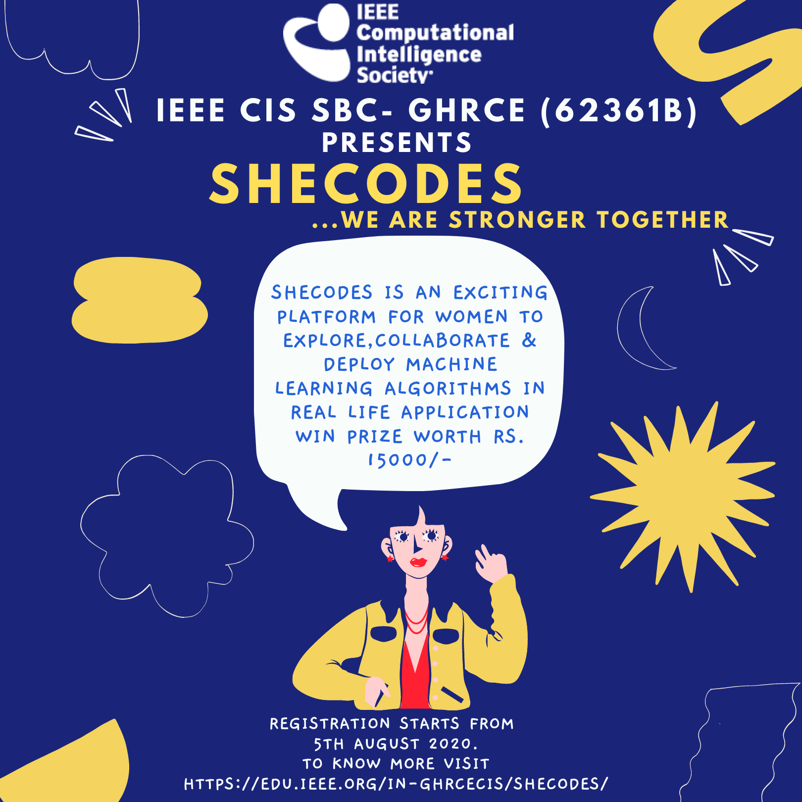

# Events 2020

This repository contains the events held by IEEE CIS SBC - GHRCE in the year 2020.

## Alexa Skill Development Workshop & Hackathon
***Date-*** 11th Jan 2020

***Description-***
IEEE CIS SBC- GHRCE had organized a workshop on Alexa Skill Development Workshop and Hackathon on 11th January 2020. This workshop was the first event conducted by IEEE CIS Chapter, GHRCE. The workshop was to introduce the basic development skill required for creating new Alexa skills and was helpful for students who have just started or want to start building skills for Alexa.
The workshop covered:
* Voice-based smart systems
* Customized skills development
* Alexa Skills Developers Skills
* Alexa Skill based Hackathon  Attendees received an in-depth training on ‘how to build skills with Alexa Skills Kit (ASK)’, a collection of self-service API’s, tools, documentation and code samples that make it fast and easy to add skills to alexa. The team IEEE CIS Chapter trained total 80+ students of First Year Department to Third Year Department including AI, CSE, IT, EE department. The students were able to develop the new Alexa skills. The team IEEE CIS Chapter under guidance of then Chapter Advisor Prof. Sofia Pillai and A. Thomas (Head- Artifical Intelligence) worked hard to make this event a great success.

***Participants List-*** https://bit.ly/cis_e1

## Round Table Discussion
***Date*** 24th Jan 2020

***Description***
IEEE CIS SBC-GHRCE had organized a Round table discussion on A.I and it’s Security Aspects on 24th January 2020. The event was conducted under IEEE CIS Chapter – GHRCE. This was the second event conducted by IEEE CIS Chapter, GHRCE. The event was solely organised for all memebers of the CIS chapter.

The objectives of the event were
* To improve information analysis of the members
* To improve communication skills of the members
* To improve presentation skills of the members

## AI Summit
***Date*** 6th,7th March 2020    

 
<b>Poster 1.</b> The AI SUMMIT 2.0

    
 
<b><i>Description</i></b>       
INTERNATIONAL AI SUMMIT 2.0 was organised at GH RAISONI COLLEGE OF ENGINEERING on 6th and 7th March.The event brought a huge number of well-known personalities from across the globe.From book release to power talks it had all the components which made the event fabulous. Great speakers like Dr.Sheela Siddappa and Dr.Satish Raghvendran talked about the new age technology and how to adapt to it and majorly focusing on development with AI in the international market.
A	great amount of knowledge was shared about Cloud Computing by Mr.Rahul Deshmukh.Blockchain and uses in modern world were discussed by Mr.Pankaj Mittal.He also told about how to go through blockchain and promote it as a career.The event was fortunate to have foreign speakers such as Dawuda Iddrisu and Gerd Moeekel who inspired many by talking about the applications of AI.Overall it was mind-blowing event which covered all the important topics which are required to be known in the field of AI.

## Life of Open Source
***Date*** 14th March 2020     

 
<b>Poster 2.</b> Life of OS

    
 
<b><i>Description</i></b>      
IEEE Computational Intelligence Society in collaboration with Microsoft Student Partners successfully conducted an event ‘Life Of Open Source’ at G.H.Raisoni College of Engineeing It was a one day workshop which introduced the participants about the Version Control System (VCS) using Git and GitHub. Mr. Siddhinath Taldhi, Webm aster IEEE CIS, took the lead as the facilitator for the workshop which made the session more lively and dynamic.Around 50 participants had enrolled for the event. A Kahoot quiz was arranged at the end where the winners were gifted goodies swag by Microsoft.The winner also shared his views and opinion on the event.The entire event was organised by students under the leadership of Mr. Vedant Bahel,Chair IEEE CIS and with the coordination of Prof.A.Thomas,the chapter advisor.At the end,the certificates were given to all the participants which was followed by group photo session.

## Learn While Corona
***Date*** 15th March 2020

***Description***
IEEE CIS has a firm believe that students should use their time to learn something new and to follow this believe the chapter started with Learn While Corona program on 15th March 2020 in association with Datacamp.com. Under this 700+ students were provided free online courses in field of Machine Learning using Python & R.In these tough times of COVID-19, we have decided to volunteer and service.

## Industry Connect 1.0
***Date*** 25th,26th,27th April 2020      

 
<b>Poster 3.</b> Industry Connect 1.0

    
 
<b><i>Description</i></b>  
IEEE CIS SBC conducted an event named “INDUSTRY CONNECT 1.0”. The event was held for three days from 25th -27th April. Three different renowned speakers spoke on the topics -the role of community groups in student’s life, bridging the gap: industry demand for freshers and from corporate to startup. This event was conducted so that the students can gain knowledge on different topics as well as raise some funds for PM care funds to fight the Covid-19 pandemic.

## Webinar Data Cleaning for ML Services
***Date*** 5th July 2020      

 
<b>Poster 4.</b> Webinar for Data Cleaning

   
 
<b><i>Description</i></b>  
Data is one of the important features of every organization because it helps business leaders to make decisions based on facts, statistical numbers and trends. Data science is an extension of various data analysis fields such as data mining, statistics, predictive analysis and many more.
Data cleaning is important because it improves your data quality and in doing so, increases overall productivity. When you clean your data, all outdated or incorrect information is gone – leaving you with the highest quality information.
We the team of IEEE CIS SBC- GHRCE understood that if the growth of data science with the use of machine learning increasing techniques is increasing exponentially we must throw light on the topic. As a result we organized a webinar which focused on cleaning the data and machine learning and how both the fields can work together.
The event was conducted by Dr. Gopal Sakarkar .

IEEE CIS Chapter and  G. H. Raisoni College of Engineering, Nagpur had organized a webinar on
Data cleaning techniques using Machine Learning Algorithms on 5th July 2020. This workshop was the first event conducted by IEEE CIS Chapter, GHRCE. The workshop was to get familiar with Data Cleaning techniques such as to identify and remove errors & duplicate data, in order to create a reliable dataset. To improve the quality of the training data for analytics and enable accurate decision-making and is helpful for students who have just started or want to start Machine Learning or Data Science.
The workshop covered:   
- Data Cleaning
- Data Integration
- Data Transformation
- Data Reduction
- Data Discretization      

Attendees received an in-depth training on ‘how to preprocess the data’, a collection of data pre-processing steps such as data rescaling, data standardization, data normalization, data binarization etc. The team IEEE CIS Chapter, GHRCE trained total 150+ students of various colleges all over the India. There were more than 30 students foregin students who had participated in this webinar. E-Certificates were provided to all the participants. The students learned how to preprocess the data for making it compatible for Machine Learning Algorithms. The team IEEE CIS Chapter, GHRCE, Dr. Gopal Sakarkar and A. Thomas (Head- Artificial Intelligence) worked hard to make this event a great success.    

## SheCodes   
**_Date_**: 5th August to 17th October, 2020     

 
<b>Poster 5.</b> She Codes

   
 
<b><i>Description</i></b>  
SheCodes is an exciting platform for women to Explore,Collaborate & Deploy
Machine Learning algorithms in Real life application.   
The efforts are being made by SheCodes to ” Bridging the Gender-gap” towards
technology and bringing out the creativity and innovation among women.   
SheCodes provide useful skills to start new journey toward Artificial Intelligence
and Machine Learning that will be helpful to cope up with the upcoming technological advances.    

## SheHacks
**_Date_**: 20th September to 17th October, 2020     
**_Description_**:   
SheHacks is a hackathon exclusively for women to give them an opportunity to
showcase their amazing skills. This is an opportunity to Win and to show that
women can Analyze, Create and Deploy solutions of real life problem statements.

## Tech-Convocation
**_Date_**: 9th, 10th and 11th October, 2020    

 
<b>Poster 6.</b> Tech-Convocation

   
 
<b><i>Description</i></b>  
Tech convocation is an exhilarating platform to showcase your cognizance about
Artificial Intelligence in various disciplines.   

AI is “A core, transformative way by which we are Re-thinking how we’re doing everything.”    

Participants from different countries shared their opinion about AI,
listened to others and boosted knowledge in different aspects of Artificial Intelligence.   

### Support or Contact

Having doubts, queries or questions?
Email: sbc-ghrce-cis@ieee.org
